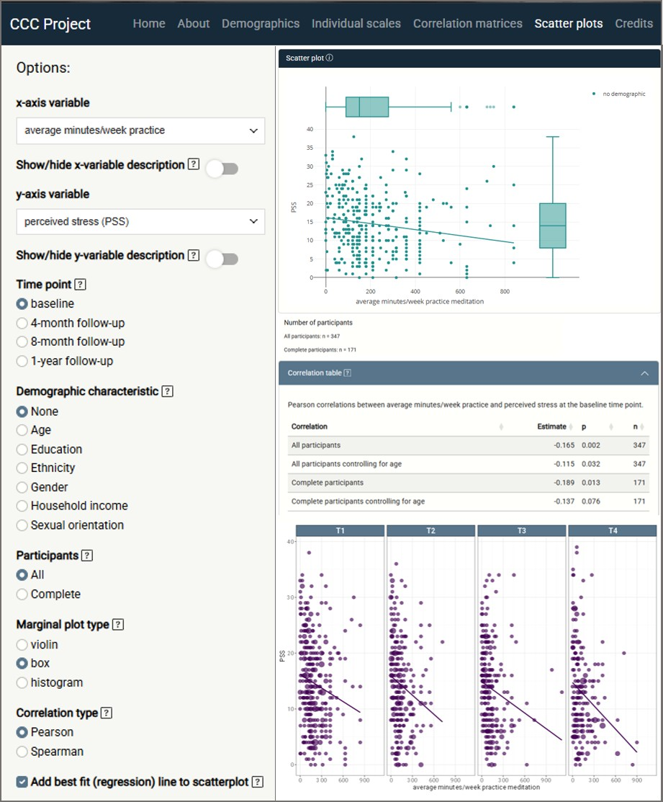
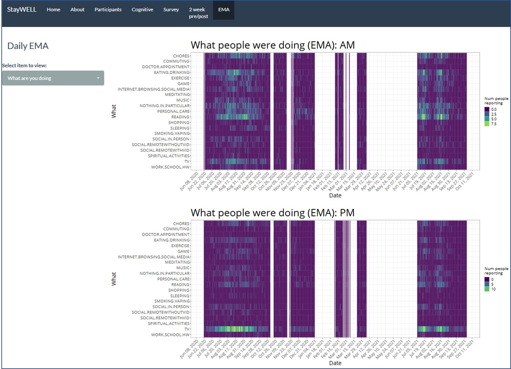
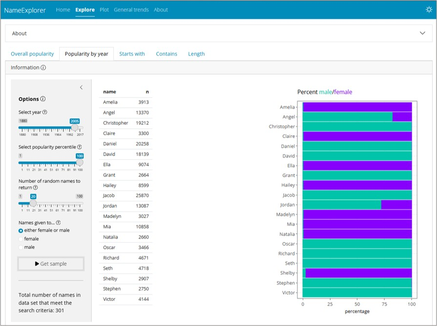

A sample of interactive data tools I've built using R and Shiny. Each app was designed to make complex data accessible - whether for research teams, study participants, or anyone curious about a dataset.

*Additional projects are in development, adapted from consulting work to demonstrate transferable capabilities.*

---

## CCC Study Dashboard

::: {.portfolio-card}
::: {.portfolio-img}
{fig-alt="Screenshot of the CCC Study Dashboard showing data visualizations from the Contemplative Coping COVID-19 study"}
:::

::: {.portfolio-desc}
**What it does:** An interactive outcomes dashboard built for a UC Davis research team studying mindfulness-based coping during the COVID-19 pandemic. Allows researchers to explore participant stress exposures and wellbeing outcomes across multiple time points and filter by demographic and practice variables.

**The challenge:** Integrating 25M+ data points from 14 disparate sources into a single coherent interface that both researchers and non-technical stakeholders could navigate.

**Built with:** R · Shiny · ggplot2 · plotly · tidyverse · exploratory data analysis

**Context:** Academic research project, UC Davis

::: {.portfolio-links}
[ View App](https://contemplative-coping-covid-19.shinyapps.io/dashboard/){.btn .btn-primary target="_blank"}
[ View Code](https://github.com/jpoko/ccc-dashboard){.btn .btn-outline-secondary target="_blank"}
:::
:::
:::

---

## StayWELL Study App

::: {.portfolio-card}
::: {.portfolio-img}
{fig-alt="Screenshot of the StayWELL Study App showing wellbeing study findings"}
:::

::: {.portfolio-desc}
**What it does:** An interactive data visualization tool built for the UC San Diego StayWELL Project, which assessed the wellbeing of older adults during the COVID-19 pandemic, enabling researchers to explore and share study findings with other investigators and stakeholders. Designed to present ellbeing data in a format accessible to both research and clinical audiences.

**The challenge:** Translating complex longitudinal wellbeing data into a navigable interface that serves multiple audiences - from principal investigators to clinicians unfamiliar with raw study output.

**Built with:** R · Shiny · ggplot2 · plotly · tidyverse

**Context:** Freelance contract, UC San Diego (2023)

::: {.portfolio-links}
[ View App](https://staywell.shinyapps.io/StayWELLStudy/){.btn .btn-primary target="_blank"}
:::
:::
:::

---

## Name Explorer

::: {.portfolio-card}
::: {.portfolio-img}
{fig-alt="Screenshot of the Name Explorer app showing name trend visualizations"}
:::

::: {.portfolio-desc}
**What it does:** An interactive explorer for U.S. baby name trends, letting users search by name, filter by starting letter, length, or contained string, and visualize popularity over time by year and gender. A fun tool that demonstrates clean UI design and responsive data exploration on a universally relatable dataset.

**The challenge:** Making a large, multi-dimensional dataset genuinely fun and fast to explore - with enough filter combinations to satisfy a curious user without overwhelming them.

**Built with:** R · Shiny · ggplot2 · plotly · tidyverse

**Context:** Personal project

::: {.portfolio-links}
[ View App](https://jen-pokorny.shinyapps.io/NameExplorer/){.btn .btn-primary target="_blank"}
[ View Code](https://github.com/jpoko/NameExplorer){.btn .btn-outline-secondary target="_blank"}
:::
:::
:::
